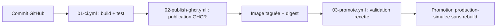

# 02 - Schéma de la chaîne CICD

## Schéma logique

## Explication des étapes

**Étape 1 — Commit GitHub** : le développeur pousse son code sur le dépôt GitHub. C'est l'événement déclencheur de toute la chaîne.

**Étape 2 — 01-ci.yml (Build + Test)** : ce workflow se déclenche à chaque push ou pull request. Il vérifie la présence des fichiers attendus, valide la syntaxe du compose.yml, construit l'image Docker avec le SHA du commit comme tag, puis lance un conteneur et effectue des tests HTTP (vérification que le site répond, que version.json est accessible, que le contenu attendu est présent).

**Étape 3 — 02-publish-ghcr.yml (Publication GHCR)** : déclenché uniquement sur la branche main, ce workflow se connecte à GHCR avec le GITHUB_TOKEN, construit l'image avec les métadonnées Docker (tags sha- et latest), puis la publie dans le registre.

**Étape 4 — Image taguée + digest** : l'image est maintenant disponible dans GHCR avec un tag identifiable (sha-xxxxxxx) et un digest SHA256 unique. Ces deux identifiants garantissent la traçabilité.

**Étape 5 — 03-promote.yml (Validation recette)** : déclenché manuellement via workflow_dispatch, ce workflow télécharge l'image depuis GHCR (sans la reconstruire), la lance dans un environnement GitHub simulé "recette" et effectue les mêmes tests HTTP.

**Étape 6 — Promotion production-simulee** : si la recette est validée, le même artefact est re-tagué `production-simulee` et poussé dans GHCR. Aucun rebuild n'a lieu : c'est exactement la même image binaire qui passe de recette à production.

## Orchestration légère

Le fichier `compose.yml` décrit deux services coordonnés :

- **web** : le service principal, construit à partir du Dockerfile local. Il sert le site statique Nginx sur le port 80 avec un healthcheck intégré.
- **tester** : un conteneur éphémère basé sur `curlimages/curl` qui attend le démarrage du service web puis effectue des requêtes HTTP de validation sur `/` et `/version.json`.

Docker Compose joue ici le rôle d'orchestrateur léger : il gère le cycle de vie des conteneurs, les dépendances entre services (depends_on), le réseau interne (cicd_net) et permet une simulation de scaling avec `--scale web=2`.

## Limite importante

Docker Compose est utile pour une mise en situation, un test local ou une démonstration de coordination entre conteneurs. Cependant, il ne remplace pas une orchestration de production. En environnement réel, il faudrait traiter : la haute disponibilité (redémarrage automatique sur plusieurs nœuds), la répartition de charge (load balancer devant les instances), la supervision (métriques, alertes), la politique de déploiement (rolling update, blue-green), le rollback automatisé, la sécurité réseau (segmentation, TLS), et la sauvegarde/restauration.
